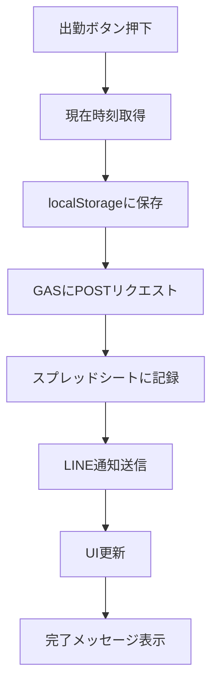
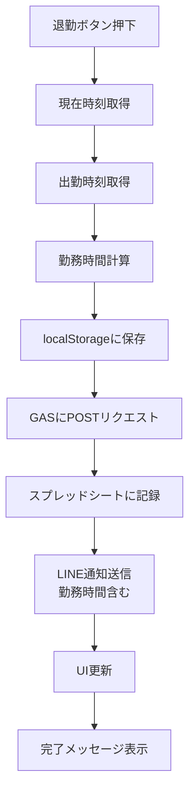
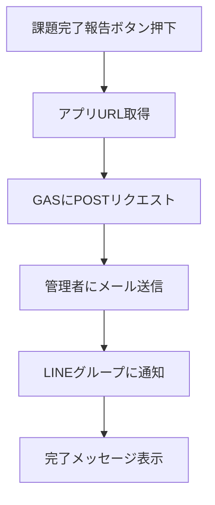

# 勤怠管理アプリ 仕様書

## 1. 概要

本アプリケーションは、スマートフォンから簡単に出勤・退勤の打刻ができる勤怠管理システムです。PWA（Progressive Web App）として動作し、スマホのホーム画面に追加してネイティブアプリのように使用できます。打刻情報はGoogleスプレッドシートに自動記録され、LINEグループへリアルタイムで通知されます。

## 2. 目的

- スマートフォンから手軽に勤怠打刻を行う
- 勤務時間を自動計算し、記録を一元管理する
- LINEグループへの通知により、チーム全体で勤怠状況を共有する
- PWA対応により、アプリのような快適な操作性を提供する

## 3. 主要機能

### 3.1 出勤打刻機能
- **操作**: 「出勤」ボタンを押下
- **処理内容**:
  - 現在時刻を取得し、出勤時刻として記録
  - Googleスプレッドシートに出勤時刻を記録
  - LINEグループに出勤通知を送信
  - ユーザーに打刻完了のフィードバックを表示

### 3.2 退勤打刻機能
- **操作**: 「退勤」ボタンを押下
- **処理内容**:
  - 現在時刻を取得し、退勤時刻として記録
  - 出勤時刻との差分から勤務時間を自動計算
  - Googleスプレッドシートに退勤時刻と勤務時間を記録
  - LINEグループに退勤通知（勤務時間含む）を送信
  - ユーザーに打刻完了と勤務時間のフィードバックを表示

### 3.3 課題完了報告機能
- **操作**: 「課題完了報告」ボタンを押下
- **処理内容**:
  - アプリのURLを管理者に自動送信（メールまたはLINE）
  - LINEグループに課題完了の通知を送信
  - 完了報告の送信完了をユーザーに表示

### 3.4 勤怠履歴表示機能
- **表示内容**:
  - 日付
  - 出勤時刻
  - 退勤時刻
  - 勤務時間
  - ステータス（出勤中/退勤済み）
- **機能**:
  - 当日の勤怠状況を表示
  - 過去の勤怠履歴を一覧表示
  - 月次集計の表示

### 3.5 PWA機能
- **特徴**:
  - スマホのホーム画面に追加可能
  - オフライン対応（Service Worker使用）
  - アプリのようなフルスクリーン表示
  - プッシュ通知対応（オプション）
  - インストール可能なアプリとして動作

## 4. 画面構成

### 4.1 メイン画面
```
┌─────────────────────────────┐
│   勤怠管理アプリ              │
├─────────────────────────────┤
│                             │
│  現在時刻: 2025/11/25 17:08 │
│                             │
│  ┌───────────────────────┐  │
│  │   出勤                │  │
│  └───────────────────────┘  │
│                             │
│  ┌───────────────────────┐  │
│  │   退勤                │  │
│  └───────────────────────┘  │
│                             │
│  ┌───────────────────────┐  │
│  │   課題完了報告         │  │
│  └───────────────────────┘  │
│                             │
│  ─────────────────────────  │
│                             │
│  本日の勤怠                  │
│  出勤: 09:00                │
│  退勤: --:--                │
│  勤務時間: 計算中            │
│                             │
│  ─────────────────────────  │
│                             │
│  勤怠履歴                    │
│  ┌───────────────────────┐  │
│  │ 2025/11/24            │  │
│  │ 出勤: 09:00           │  │
│  │ 退勤: 18:00           │  │
│  │ 勤務: 9時間0分         │  │
│  └───────────────────────┘  │
│                             │
└─────────────────────────────┘
```

### 4.2 設定画面（オプション）
- ユーザー名設定
- LINE通知設定
- スプレッドシートURL設定
- 通知音設定

## 5. 入出力仕様

### 5.1 入力
| 項目 | 形式 | 必須 | 備考 |
|------|------|------|------|
| ユーザー名 | テキスト | ○ | 初回起動時に設定 |
| 打刻ボタン | ボタン押下 | ○ | 出勤/退勤/課題完了 |

### 5.2 出力

#### 5.2.1 Googleスプレッドシート
| 列 | 項目 | 形式 | 備考 |
|----|------|------|------|
| A | 日付 | YYYY/MM/DD | 打刻日 |
| B | ユーザー名 | テキスト | 打刻者 |
| C | 出勤時刻 | HH:MM:SS | 出勤打刻時刻 |
| D | 退勤時刻 | HH:MM:SS | 退勤打刻時刻 |
| E | 勤務時間 | HH:MM | 自動計算 |
| F | ステータス | テキスト | 出勤中/退勤済み |
| G | タイムスタンプ | YYYY/MM/DD HH:MM:SS | 記録日時 |

#### 5.2.2 LINE通知メッセージ

**出勤通知:**
```
【出勤打刻】
名前: 山田太郎
時刻: 2025/11/25 09:00
```

**退勤通知:**
```
【退勤打刻】
名前: 山田太郎
時刻: 2025/11/25 18:00
勤務時間: 9時間0分
お疲れ様でした！
```

**課題完了通知:**
```
【課題完了報告】
名前: 山田太郎
アプリURL: https://script.google.com/...
完了日時: 2025/11/25 17:08
```

## 6. 技術仕様

### 6.1 フロントエンド
- **HTML5**: セマンティックなマークアップ
- **CSS3**: レスポンシブデザイン、モダンなUI
- **JavaScript (ES6+)**: アプリケーションロジック

### 6.2 PWA関連
- **manifest.json**: アプリメタデータ、アイコン設定
- **Service Worker**: オフライン対応、キャッシュ管理
- **HTTPS**: セキュアな通信（必須）

### 6.3 バックエンド
- **Google Apps Script (GAS)**: 
  - スプレッドシート操作
  - LINE Messaging API連携
  - メール送信機能
- **Google Spreadsheet**: データ永続化

### 6.4 外部API
- **LINE Messaging API**: グループ通知機能
- **Google Sheets API**: データ読み書き

### 6.5 データ保存
- **localStorage**: 
  - ユーザー設定
  - 一時的な打刻データ
  - オフライン時のデータキュー
- **Google Spreadsheet**: 
  - 永続的な勤怠記録
  - 履歴データ

## 7. データ構造

### 7.1 localStorage

```javascript
// ユーザー設定
{
  "userName": "山田太郎",
  "gasUrl": "https://script.google.com/...",
  "lineNotifyToken": "xxx",
  "lastClockIn": "2025-11-25T09:00:00",
  "isWorking": true
}

// 勤怠履歴（オフライン時のキュー）
{
  "pendingRecords": [
    {
      "date": "2025-11-25",
      "userName": "山田太郎",
      "clockIn": "09:00:00",
      "clockOut": null,
      "workHours": null,
      "status": "出勤中",
      "timestamp": "2025-11-25T09:00:00"
    }
  ]
}
```

### 7.2 Googleスプレッドシート構造

**シート名: 勤怠記録**

| 日付 | ユーザー名 | 出勤時刻 | 退勤時刻 | 勤務時間 | ステータス | タイムスタンプ |
|------|-----------|---------|---------|---------|-----------|--------------|
| 2025/11/25 | 山田太郎 | 09:00:00 | 18:00:00 | 9:00 | 退勤済み | 2025/11/25 18:00:00 |
| 2025/11/24 | 山田太郎 | 09:15:00 | 17:45:00 | 8:30 | 退勤済み | 2025/11/24 17:45:00 |

## 8. 処理フロー

### 8.1 出勤打刻フロー



### 8.2 退勤打刻フロー



### 8.3 課題完了報告フロー



## 9. セキュリティ要件

### 9.1 認証・認可
- 初回起動時のユーザー名設定
- GAS Web AppのデプロイURL保護
- LINE Notify トークンの安全な保管

### 9.2 データ保護
- HTTPS通信の必須化
- 個人情報の暗号化（localStorage）
- APIキーの環境変数管理

### 9.3 エラーハンドリング
- ネットワークエラー時の再送機能
- オフライン時のデータキューイング
- タイムアウト処理

## 10. PWA実装要件

### 10.1 manifest.json
```json
{
  "name": "勤怠管理アプリ",
  "short_name": "勤怠管理",
  "description": "簡単に出退勤を記録できる勤怠管理アプリ",
  "start_url": "/",
  "display": "standalone",
  "background_color": "#ffffff",
  "theme_color": "#4285f4",
  "orientation": "portrait",
  "icons": [
    {
      "src": "/icons/icon-192.png",
      "sizes": "192x192",
      "type": "image/png"
    },
    {
      "src": "/icons/icon-512.png",
      "sizes": "512x512",
      "type": "image/png"
    }
  ]
}
```

### 10.2 Service Worker機能
- **キャッシュ戦略**: 
  - HTML/CSS/JS: Cache First
  - API通信: Network First
- **オフライン対応**: 
  - オフライン時は打刻データをlocalStorageに保存
  - オンライン復帰時に自動同期
- **バックグラウンド同期**: 
  - 未送信データの自動送信

## 11. UI/UXデザイン要件

### 11.1 デザインコンセプト
- **シンプル**: 必要最小限の操作で打刻完了
- **視認性**: 大きなボタン、読みやすいフォント
- **フィードバック**: 操作結果を即座に表示
- **モバイルファースト**: スマホでの使用を最優先に設計
- **リラックス感**: パステルカラーと寒色系で落ち着いた雰囲気

### 11.2 カラースキーム（パステル寒色系）

#### メインカラー
- **プライマリカラー**: `#A8D8EA` (パステルブルー)
  - 用途: 出勤ボタン、ヘッダー背景
  - 印象: 爽やか、信頼感
  
- **セカンダリカラー**: `#B8E6D5` (パステルミント)
  - 用途: 退勤ボタン、成功メッセージ
  - 印象: 安心感、完了感

- **アクセントカラー**: `#C5B9E8` (パステルラベンダー)
  - 用途: 課題完了ボタン、重要な通知
  - 印象: 特別感、達成感

#### 背景カラー
- **メイン背景**: `#F0F4F8` (ライトブルーグレー)
  - 用途: 全体の背景
  - 印象: 清潔感、落ち着き

- **カード背景**: `#FFFFFF` (ホワイト)
  - 用途: 勤怠履歴カード、情報表示エリア
  - 印象: 明瞭性、読みやすさ

#### テキストカラー
- **メインテキスト**: `#2C3E50` (ダークブルーグレー)
  - 用途: 本文、見出し
  
- **サブテキスト**: `#7F8C8D` (ミディアムグレー)
  - 用途: 補足情報、タイムスタンプ

#### ステータスカラー
- **出勤中**: `#A8D8EA` (パステルブルー)
- **退勤済み**: `#B8E6D5` (パステルミント)
- **エラー**: `#F5B7B1` (パステルピンク)
- **警告**: `#FAD7A0` (パステルオレンジ)

### 11.3 レスポンシブデザイン（モバイルファースト）

#### スマホ向けレイアウト（縦向き）
- **対象画面サイズ**: 375px × 667px 〜 414px × 896px
- **縦横比**: 9:16 〜 9:19.5（一般的なスマホ）
- **最大幅**: 480px（それ以上は中央寄せ）

#### レイアウト構成
```
┌─────────────────────────────┐
│  ヘッダー (60px)             │ ← パステルブルー背景
├─────────────────────────────┤
│                             │
│  現在時刻表示 (80px)         │ ← 大きく見やすく
│                             │
│  ┌───────────────────────┐  │
│  │   出勤 (70px高)       │  │ ← パステルブルー
│  └───────────────────────┘  │
│                             │
│  ┌───────────────────────┐  │
│  │   退勤 (70px高)       │  │ ← パステルミント
│  └───────────────────────┘  │
│                             │
│  ┌───────────────────────┐  │
│  │ 課題完了報告 (60px高) │  │ ← パステルラベンダー
│  └───────────────────────┘  │
│                             │
│  ─────────────────────────  │
│                             │
│  本日の勤怠 (カード)         │ ← 白背景、影付き
│  ┌───────────────────────┐  │
│  │ 出勤: 09:00           │  │
│  │ 退勤: --:--           │  │
│  │ 勤務時間: 計算中       │  │
│  └───────────────────────┘  │
│                             │
│  勤怠履歴 (スクロール可能)   │
│  ┌───────────────────────┐  │
│  │ 2025/11/24            │  │
│  │ 出勤: 09:00           │  │
│  │ 退勤: 18:00           │  │
│  │ 勤務: 9時間0分         │  │
│  └───────────────────────┘  │
│                             │
└─────────────────────────────┘
```

#### ブレイクポイント
```css
/* スマホ（縦向き） */
@media (max-width: 480px) {
  - フォントサイズ: 16px（基準）
  - ボタン高さ: 60-70px
  - 余白: 16px
  - カード間隔: 12px
}

/* タブレット（縦向き） */
@media (min-width: 481px) and (max-width: 768px) {
  - フォントサイズ: 18px
  - ボタン高さ: 70-80px
  - 余白: 24px
  - カード間隔: 16px
}

/* PC・タブレット（横向き） */
@media (min-width: 769px) {
  - 最大幅: 480px（中央寄せ）
  - フォントサイズ: 18px
  - ボタン高さ: 70-80px
  - 余白: 32px
}
```

### 11.4 タイポグラフィ

#### フォントファミリー
```css
font-family: 
  -apple-system, 
  BlinkMacSystemFont, 
  'Segoe UI', 
  'Noto Sans JP', 
  'Hiragino Sans', 
  sans-serif;
```

#### フォントサイズ
- **ヘッダー**: 24px（太字）
- **現在時刻**: 32px（太字）
- **ボタンテキスト**: 20px（太字）
- **本文**: 16px（標準）
- **小テキスト**: 14px（標準）
- **タイムスタンプ**: 12px（細字）

#### 行間
- **本文**: 1.6
- **ボタン**: 1.2
- **見出し**: 1.4

### 11.5 ボタンデザイン

#### 出勤ボタン
```css
background: linear-gradient(135deg, #A8D8EA 0%, #9ECFE0 100%);
border-radius: 16px;
box-shadow: 0 4px 12px rgba(168, 216, 234, 0.3);
height: 70px;
font-size: 20px;
font-weight: bold;
color: #2C3E50;
transition: all 0.3s ease;
```

#### 退勤ボタン
```css
background: linear-gradient(135deg, #B8E6D5 0%, #A8DCCA 100%);
border-radius: 16px;
box-shadow: 0 4px 12px rgba(184, 230, 213, 0.3);
height: 70px;
font-size: 20px;
font-weight: bold;
color: #2C3E50;
transition: all 0.3s ease;
```

#### 課題完了ボタン
```css
background: linear-gradient(135deg, #C5B9E8 0%, #B8ACDE 100%);
border-radius: 16px;
box-shadow: 0 4px 12px rgba(197, 185, 232, 0.3);
height: 60px;
font-size: 18px;
font-weight: bold;
color: #2C3E50;
transition: all 0.3s ease;
```

#### ホバー・アクティブ状態
```css
/* ホバー時 */
:hover {
  transform: translateY(-2px);
  box-shadow: 0 6px 16px rgba(0, 0, 0, 0.15);
}

/* アクティブ時 */
:active {
  transform: translateY(0);
  box-shadow: 0 2px 8px rgba(0, 0, 0, 0.1);
}
```

### 11.6 カードデザイン

#### 勤怠カード
```css
background: #FFFFFF;
border-radius: 12px;
box-shadow: 0 2px 8px rgba(0, 0, 0, 0.08);
padding: 20px;
margin: 12px 0;
border-left: 4px solid #A8D8EA;
```

#### 履歴カード
```css
background: #FFFFFF;
border-radius: 12px;
box-shadow: 0 2px 8px rgba(0, 0, 0, 0.08);
padding: 16px;
margin: 8px 0;
transition: all 0.2s ease;
```

### 11.7 アニメーション

#### ボタン押下時
```css
@keyframes buttonPress {
  0% { transform: scale(1); }
  50% { transform: scale(0.95); }
  100% { transform: scale(1); }
}
```

#### 打刻完了時
```css
@keyframes successPulse {
  0% { opacity: 0; transform: scale(0.8); }
  50% { opacity: 1; transform: scale(1.1); }
  100% { opacity: 1; transform: scale(1); }
}
```

#### カードフェードイン
```css
@keyframes fadeInUp {
  from {
    opacity: 0;
    transform: translateY(20px);
  }
  to {
    opacity: 1;
    transform: translateY(0);
  }
}
```

#### ローディングアニメーション
```css
@keyframes spin {
  0% { transform: rotate(0deg); }
  100% { transform: rotate(360deg); }
}
```

### 11.8 アイコン

#### 使用アイコン
- **出勤**: 🌅 または ▶️
- **退勤**: 🌙 または ⏸️
- **課題完了**: ✅ または 📝
- **時計**: 🕐
- **カレンダー**: 📅
- **チェック**: ✓
- **エラー**: ⚠️

#### アイコンサイズ
- **ボタン内**: 24px
- **ステータス**: 20px
- **小アイコン**: 16px

### 11.9 スペーシング

#### 余白システム
```css
--spacing-xs: 4px;
--spacing-sm: 8px;
--spacing-md: 16px;
--spacing-lg: 24px;
--spacing-xl: 32px;
```

#### コンテナ余白
- **画面端**: 16px（スマホ）、24px（タブレット）
- **セクション間**: 24px
- **カード間**: 12px
- **ボタン間**: 16px

### 11.10 アクセシビリティ

#### タッチターゲット
- **最小サイズ**: 44px × 44px（Apple推奨）
- **推奨サイズ**: 48px × 48px（Material Design推奨）
- **ボタン高さ**: 60-70px（十分なタップエリア）

#### コントラスト比
- **本文テキスト**: 4.5:1 以上
- **大きなテキスト**: 3:1 以上
- **ボタンテキスト**: 4.5:1 以上

#### フォーカス表示
```css
:focus {
  outline: 3px solid #A8D8EA;
  outline-offset: 2px;
}
```


## 12. 非機能要件

### 12.1 パフォーマンス
- 初回ロード時間: 3秒以内
- 打刻処理完了: 2秒以内
- Service Workerによる高速起動

### 12.2 可用性
- オフライン時も打刻可能
- データ同期の自動リトライ
- エラー時の適切なメッセージ表示

### 12.3 保守性
- コードのモジュール化
- 設定の外部化
- ログ機能の実装

### 12.4 拡張性
- 複数ユーザー対応の準備
- 休憩時間記録機能の追加可能性
- 有給管理機能の追加可能性

## 13. テスト要件

### 13.1 単体テスト
- 勤務時間計算ロジック
- 日付・時刻処理
- データバリデーション

### 13.2 結合テスト
- GAS連携
- LINE通知
- スプレッドシート書き込み

### 13.3 E2Eテスト
- 出勤→退勤の一連の流れ
- オフライン→オンライン復帰
- PWAインストール

### 13.4 デバイステスト
- iOS Safari
- Android Chrome
- PC各種ブラウザ

## 13.5 受け入れテスト項目

アプリが正しく動作することを確認するための受け入れテスト項目です。以下の全項目をクリアすることで、アプリの完成とします。

### ✅ テスト項目1: 出勤ボタンでLINE通知が届く

**テスト手順:**
1. アプリを開く
2. 「出勤」ボタンを押下
3. LINEグループを確認

**期待結果:**
- ✅ LINEグループに以下の形式で通知が届く
  ```
  【出勤打刻】
  名前: [ユーザー名]
  時刻: [日付] [時刻]
  ```
- ✅ 通知が送信されてから30秒以内に届く
- ✅ 通知内容に正しい日時とユーザー名が含まれている

**確認ポイント:**
- LINE Messaging APIが正しく設定されているか
- チャネルアクセストークンが有効か
- グループIDが正しく設定されているか

---

### ✅ テスト項目2: 退勤ボタンで勤務時間が計算される

**テスト手順:**
1. 出勤打刻を行う（例: 09:00）
2. 一定時間後、「退勤」ボタンを押下（例: 18:00）
3. 画面に表示される勤務時間を確認

**期待結果:**
- ✅ 勤務時間が自動計算される（例: 9時間0分）
- ✅ 計算結果が画面に表示される
- ✅ 時間の計算が正確である（出勤時刻〜退勤時刻の差分）

**確認ポイント:**
- 勤務時間の計算ロジックが正しいか
- 時間のフォーマットが「X時間Y分」形式か
- 深夜をまたぐ場合も正しく計算されるか

---

### ✅ テスト項目3: スプレッドシートに正しく記録される

**テスト手順:**
1. 出勤打刻を行う
2. 退勤打刻を行う
3. Googleスプレッドシートを開いて確認

**期待結果:**
- ✅ スプレッドシートに新しい行が追加される
- ✅ 以下の情報が正しく記録されている:
  - A列: 日付（YYYY/MM/DD形式）
  - B列: ユーザー名
  - C列: 出勤時刻（HH:MM:SS形式）
  - D列: 退勤時刻（HH:MM:SS形式）
  - E列: 勤務時間（HH:MM形式）
  - F列: ステータス（「出勤中」→「退勤済み」）
  - G列: タイムスタンプ
- ✅ データが上書きされず、追記される

**確認ポイント:**
- スプレッドシートIDが正しく設定されているか
- GASがスプレッドシートへの書き込み権限を持っているか
- 出勤時と退勤時で同じ行が更新されるか

---

### ✅ テスト項目4: 課題完了ボタンで管理者に通知が届く

**テスト手順:**
1. 「課題完了報告」ボタンを押下
2. 管理者のメールボックスを確認
3. LINEグループを確認

**期待結果:**
- ✅ 管理者のメールアドレスにメールが届く
- ✅ メールに以下の情報が含まれる:
  - 報告者名
  - アプリURL
  - 完了日時
- ✅ LINEグループに課題完了通知が届く
  ```
  【課題完了報告】
  名前: [ユーザー名]
  アプリURL: [URL]
  完了日時: [日時]
  ```

**確認ポイント:**
- 管理者メールアドレスが正しく設定されているか
- アプリURLが正しく設定されているか
- メール送信権限があるか

---

### ✅ テスト項目5: PWAとしてスマホにインストールできる

**テスト手順（iOS）:**
1. SafariでアプリURLを開く
2. 共有ボタン（□↑）をタップ
3. 「ホーム画面に追加」を選択
4. ホーム画面にアイコンが追加されることを確認
5. アイコンをタップしてアプリを起動

**テスト手順（Android）:**
1. ChromeでアプリURLを開く
2. メニュー（⋮）→「ホーム画面に追加」を選択
3. または、アドレスバーに表示される「インストール」ボタンをタップ
4. ホーム画面にアイコンが追加されることを確認
5. アイコンをタップしてアプリを起動

**期待結果:**
- ✅ ホーム画面にアプリアイコンが追加される
- ✅ アイコンをタップするとフルスクリーンで起動する
- ✅ ブラウザのUIが表示されない（スタンドアロンモード）
- ✅ アプリ名が「勤怠管理アプリ」または「勤怠管理」と表示される
- ✅ オフライン時も起動できる

**確認ポイント:**
- `manifest.json`が正しく配置されているか
- アイコン画像（192x192, 512x512）が用意されているか
- HTTPSでホスティングされているか
- Service Workerが正しく登録されているか

---

### 📋 受け入れテストチェックリスト

アプリ完成の判定基準として、以下の全項目をチェックしてください:

- [ ] **テスト1**: 出勤ボタンでLINE通知が届く
- [ ] **テスト2**: 退勤ボタンで勤務時間が計算される
- [ ] **テスト3**: スプレッドシートに正しく記録される
- [ ] **テスト4**: 課題完了ボタンで管理者に通知が届く
- [ ] **テスト5**: PWAとしてスマホにインストールできる

**全項目クリアで課題完了！** 🎉

---

## 14. 開発環境

### 14.1 必要なツール
- テキストエディタ（VS Code推奨）
- Webブラウザ（Chrome推奨）
- Googleアカウント
- LINE Developersアカウント

### 14.2 開発手順
1. HTMLファイル作成
2. CSS/JavaScriptファイル作成
3. PWA設定（manifest.json, Service Worker）
4. Google Apps Script作成
5. LINE Messaging API設定
6. 動作確認・デバッグ
7. デプロイ

## 15. デプロイ方法

### 15.1 GASデプロイ
1. Google Apps Scriptエディタでコード作成
2. 「デプロイ」→「新しいデプロイ」
3. 「ウェブアプリ」として公開
4. アクセス権限: 「全員」
5. デプロイURLを取得

### 15.2 フロントエンドデプロイ
- **オプション1**: GitHub Pages
- **オプション2**: Google Drive（HTML Service）
- **オプション3**: Firebase Hosting
- **オプション4**: Netlify/Vercel

### 15.3 HTTPS化
- PWA動作にはHTTPS必須
- 上記ホスティングサービスは自動でHTTPS対応

## 16. 運用・保守

### 16.1 データバックアップ
- スプレッドシートの定期バックアップ
- エクスポート機能の実装

### 16.2 監視
- エラーログの収集
- 利用状況の分析

### 16.3 アップデート
- Service Workerのバージョン管理
- キャッシュの更新戦略

## 17. 今後の拡張機能（オプション）

- [ ] 休憩時間の記録
- [ ] 残業時間の自動計算
- [ ] 月次レポート自動生成
- [ ] CSV/PDFエクスポート
- [ ] 複数ユーザー管理
- [ ] 管理者ダッシュボード
- [ ] 顔認証打刻
- [ ] GPS位置情報記録
- [ ] 勤怠承認ワークフロー
- [ ] 有給休暇管理

## 18. 参考資料

### 18.1 技術ドキュメント
- [PWA Documentation](https://web.dev/progressive-web-apps/)
- [Google Apps Script Guide](https://developers.google.com/apps-script)
- [LINE Messaging API](https://developers.line.biz/ja/docs/messaging-api/)
- [Service Worker API](https://developer.mozilla.org/ja/docs/Web/API/Service_Worker_API)

### 18.2 デザインリファレンス
- [Material Design](https://material.io/design)
- [PWA Best Practices](https://web.dev/pwa-checklist/)

---

**作成日**: 2025年11月25日  
**バージョン**: 1.0  
**作成者**: 研修課題５
